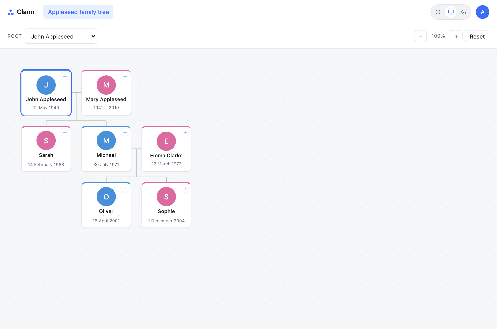
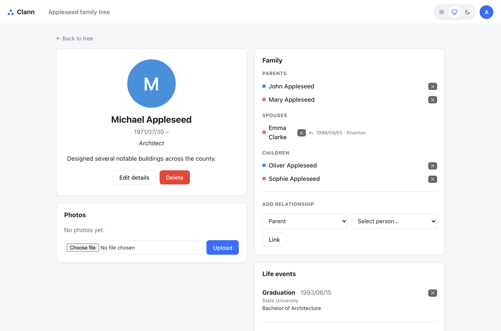
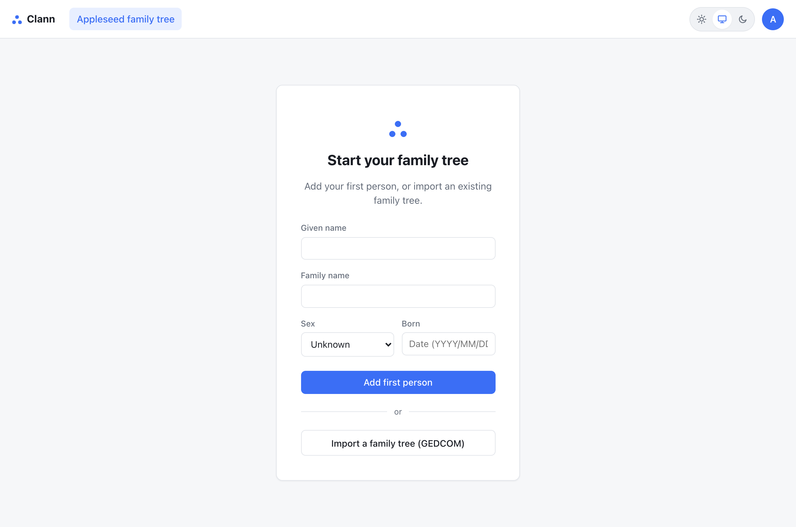

# Clann

**Clann** is a lightweight, self-hosted family-tree app with a modern UI. Build
and explore your family tree, attach photos and life stories to each person, and
import or export the whole thing as a standard GEDCOM file. It runs as a **single
container** backed by a **single SQLite file** — trivial to host and back up.

> Admins build and edit the tree; viewers browse it read-only.

---

## Screenshots

The interactive family tree:



| A person's profile | Getting started |
| --- | --- |
|  |  |

<sub>Shown in light mode with sample data.</sub>

---

## Features

### 🌳 Interactive family tree
- Pan-and-zoom canvas with automatic layout ([`relatives-tree`](https://github.com/SanichKotikov/relatives-tree)).
- Re-root the view on anyone to explore their branch.
- Colour-coded cards (male / female / unknown) with photos and a lifespan.
- Dates shown smartly: years for a lifespan (`1901 – 1974`), full dates otherwise
  (`11 July 1992`), and approximate/range dates preserved (`c. 1825`, `1883–1884`).

### ✏️ Build it in place
- Every card has a **“+”** to add a **parent, sibling, partner, or child** right
  from the tree — no forms to hunt for.
- First run prompts you to **add the first person** or **import a GEDCOM** to start.

### 👤 Rich profiles
- Photos (multiple, with a primary), occupation, biography, and **life events**
  (baptism, burial, residence, census…) with dates and places.
- Cause of death, alternate/married names, marriage date & place, divorce status,
  and source citations.

### 🔁 GEDCOM import & export
- **Import** a `.ged` file to populate the tree — individuals, parent/child &
  spouse links, events, notes, occupation, and **photos** (embedded, or fetched
  from image URLs like MyHeritage exports). Always asks before overwriting.
- **Export** your whole tree as a `.ged` with **photos embedded in the file** — a
  complete, self-contained backup that re-imports into Clann or opens in other
  genealogy apps.

### 👪 Accounts & roles
- **Admin** (full edit) and **viewer** (read-only) roles.
- Self-service account page to change your own password; admins manage all users.
- Name your tree (e.g. *“Riordan family tree”*), editable inline in the nav.
- Light / dark / system theme.

### 🏠 Self-hosted & private
- One container, one SQLite file, one volume for the database **and** photos.
- No third-party services, no telemetry — your data stays on your machine.

---

## Run it (almost) anywhere with Docker

Clann ships as a **multi-arch image** (`linux/amd64` + `linux/arm64`), so the same
`docker-compose.yml` runs on a laptop, a home server, a NAS, or a Raspberry Pi —
anywhere Docker runs.\*

```sh
docker compose up -d
```

Then open **http://localhost:3000** and complete first-run setup.

- The image is pulled from GitHub Container Registry: `ghcr.io/thatguy-za/clann:latest`
  (pin a version like `:0.6` for reproducible deploys).
- Your data — the SQLite database **and** uploaded photos — persists in the
  `clann_data` volume. Back it up by copying that volume.
- Works on **any host, port, or reverse proxy out of the box** — no `ORIGIN`
  config required. Session cookies become `Secure` automatically over HTTPS.

To change the port, edit the `ports:` mapping in `docker-compose.yml` (e.g.
`'8080:3000'`). To build from source instead of pulling the image, comment out
`image:` and uncomment `build: .`.

> \* Any 64-bit system that runs Docker. The image is glibc-based
> (`node:22-bookworm-slim`) so `better-sqlite3` uses its prebuilt binary.

---

## First run

There is **no seeded admin account**. On first boot the app has zero users and
redirects everything to `/setup`, where you create the first administrator
(username + password). After that, `/setup` locks off and everyone signs in at
`/login`. Once you’re in, the empty tree prompts you to **add the first person**
or **import a family tree**. Admins can add more admin/viewer accounts from the
account menu → **Manage users**.

---

## Configuration

All configuration is via environment variables (see `docker-compose.yml`):

| Env var | Default | Purpose |
| --- | --- | --- |
| `DATABASE_PATH` | `data/app.db` | SQLite file location |
| `UPLOAD_DIR` | `data/uploads` | Uploaded photo storage |
| `PORT` | `3000` | HTTP port (production) |
| `BODY_SIZE_LIMIT` | `Infinity` (in compose) | Max upload size; keep high for GEDCOM imports with embedded photos |
| `ORIGIN` | — | Optional. Set to your exact public URL (e.g. `https://tree.example.com`) to force `Secure` cookies |

---

## Local development

```sh
npm install
npm run dev
```

The dev server auto-creates `data/app.db` and applies migrations on boot.

| Task | Command |
| --- | --- |
| Dev server | `npm run dev` |
| Type-check | `npm run check` |
| Production build | `npm run build` then `node build` |
| Generate a migration after schema edits | `npm run db:generate` |
| Browse the DB | `npm run db:studio` |

**Stack:** SvelteKit (`adapter-node`) · SQLite via Drizzle ORM (`better-sqlite3`)
· cookie sessions with scrypt hashing. Migrations live in `./drizzle` and apply
automatically on server start; after editing `src/lib/server/schema.ts`, run
`npm run db:generate` and commit the new migration.

Releases are cut as GitHub Releases (tags `v*`), which trigger a GitHub Actions
workflow that builds and publishes the multi-arch image to GHCR.
